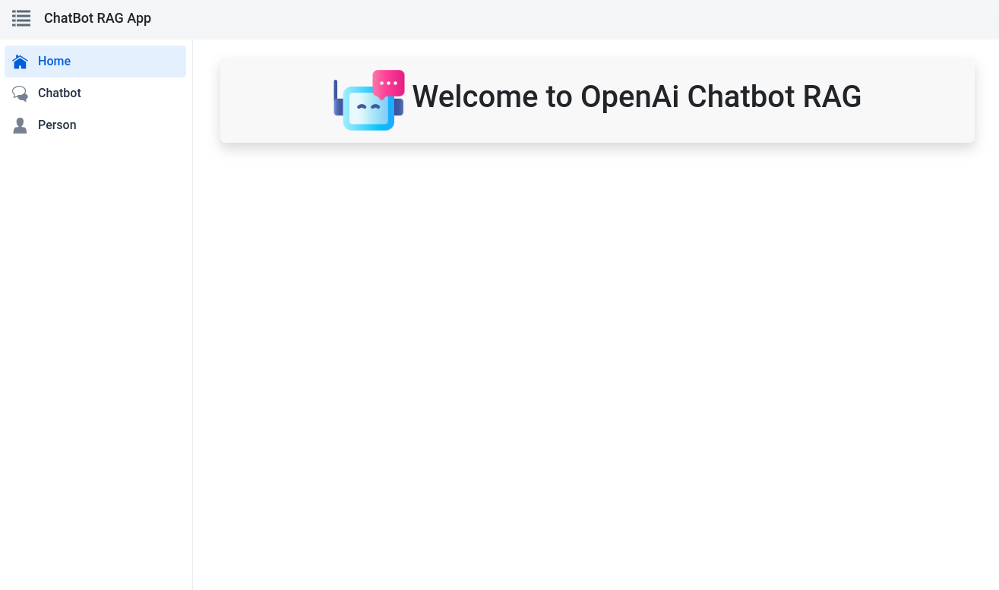
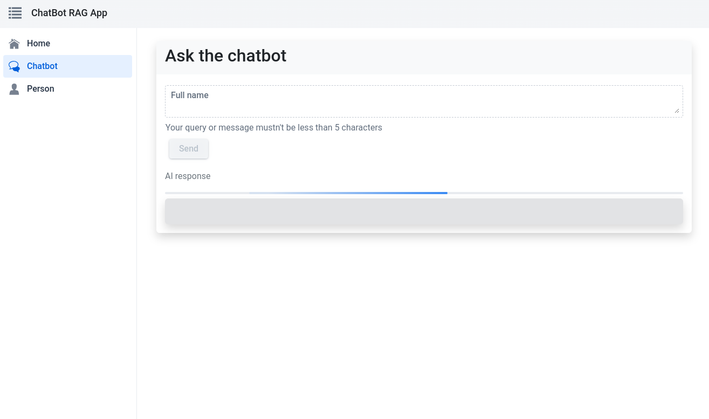
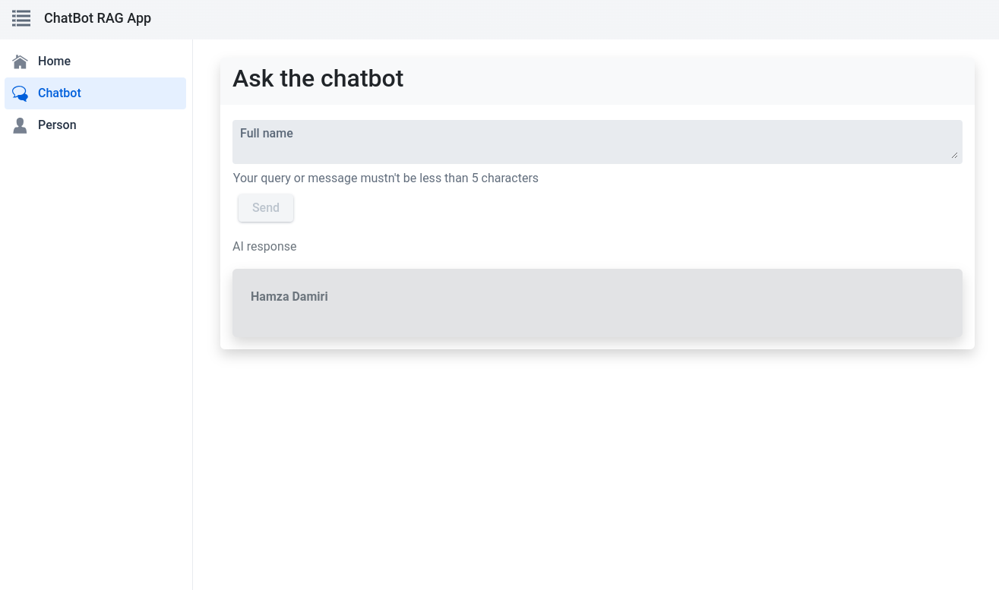
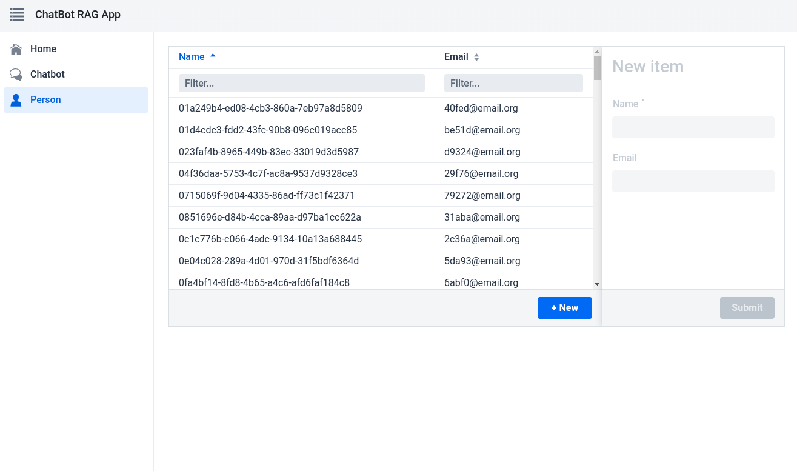

# 🚀 OpenAI Chatbot RAG Project

Welcome to the OpenAI Chatbot Retrieval Augmented Generation (RAG) project! This repository contains a full-stack web application built using Spring for the backend, React for the frontend, and Vaadin components for the UI. The primary feature of this application is a chatbot that leverages the OpenAI API with the GPT-4 model and uses a vector store for storing and providing context.

## Screen captures






## 📂 Project Structure

### 🖥️ Frontend

The frontend part of the application consists of 3 pages and 1 layout, styled with Vaadin components and Bootstrap:

1. **🏠 Index Page**:
   - **Path**: `/`
   - **Description**: This is the welcome page for the OpenAI Chatbot RAG application.

2. **💬 Chatbot Page**:
   - **Path**: `/chatbot`
   - **Description**: This page allows the user to ask questions to the chatbot, which uses data stored in a Postgres vector store as context to provide answers.

3. **👤 Person Page**:
   - **Path**: `/person`
   - **Description**: Implements AutoCRUD using data from the database.

4. **🔧 Layout**:
   - **Includes**: A top bar and a sidebar for navigation.

### 🛠️ Backend

The backend is built using Spring Boot and includes the following key components:

1. **💡 ChatBotAiService**:
   - **Package**: `ma.dev7hd.finalexamrag.services`
   - **Annotations**: `@BrowserCallable`, `@AnonymousAllowed`
   - **Description**: This service handles the chatbot functionality, including initializing the chat client and vector store, and processing questions to generate responses using RAG.

2. **📄 RagDataLoader**:
   - **Package**: `ma.dev7hd.finalexamrag.config`
   - **Annotations**: `@Component`
   - **Description**: This component initializes the vector store if it doesn't exist. It reads data from a PDF file, splits it into chunks, and stores it in the vector store.

3. **📋 Person Entity and CrudRepositoryService**:
   - **Description**: The `Person` entity is managed using Spring Data's CRUD repository functionalities for database operations.

### 🔑 Key Dependencies

- **Spring Boot**: Backend framework.
- **React**: Frontend framework.
- **Vaadin**: UI components.
- **Bootstrap**: Styling.
- **OpenAI API**: For chatbot functionality.
- **Postgres**: Database with vector store capability.
- **Docker Compose**: For managing the Postgres container.

## 🚀 Get Started

### 🛠️ Prerequisites

- JDK 11 or later
- Node.js and npm
- Docker and Docker Compose

### ⚙️ Setup Backend

1. Clone the repository and navigate to the backend directory:

    ```sh
    git clone https://github.com/Dev7HD/FINAL-PROJECT-RAG
    cd FINAL-PROJECT-RAG
    ```

2. Set up the Postgres container using Docker Compose:

    ```sh
    docker-compose up -d
    ```

3. Install dependencies and run the application:

    ```sh
    ./mvnw spring-boot:run
    ```

### ⚙️ Setup Frontend

- Install dependencies and start the development server:

    ```sh
    npm install
    npm start
    ```

### 📦 Docker Compose

The repository includes a Docker Compose file for setting up a Postgres container. Ensure Docker and Docker Compose are installed on your machine.

- Start the Postgres container:

    ```sh
    docker-compose up -d
    ```

## 🎉 Usage

- Open your browser and navigate to `http://localhost:9095`.
- You will see the index page welcoming you to the OpenAI Chatbot RAG application.
- Use the sidebar to navigate to the chatbot page and interact with the chatbot.
- Navigate to the person page to perform CRUD operations on the `Person` entity.

## 🤝 Contributing

1. Fork the repository.
2. Create a new branch:

    ```sh
    git checkout -b feature-name
    ```

3. Make your changes and commit them:

    ```sh
    git commit -m "Add new feature"
    ```

4. Push your branch:

    ```sh
    git push origin feature-name
    ```

5. Create a pull request.

## ⚖️ License

This project is licensed under the MIT License. See the [LICENSE](LICENSE) file for details.

## 📧 Contact

For any inquiries or questions, please contact [hamza.damiri@gmail.com](mailto:hamza.damiri@gmail.com).

---

Thank you for contributing and using the OpenAI Chatbot RAG project! We look forward to your feedback and contributions.
